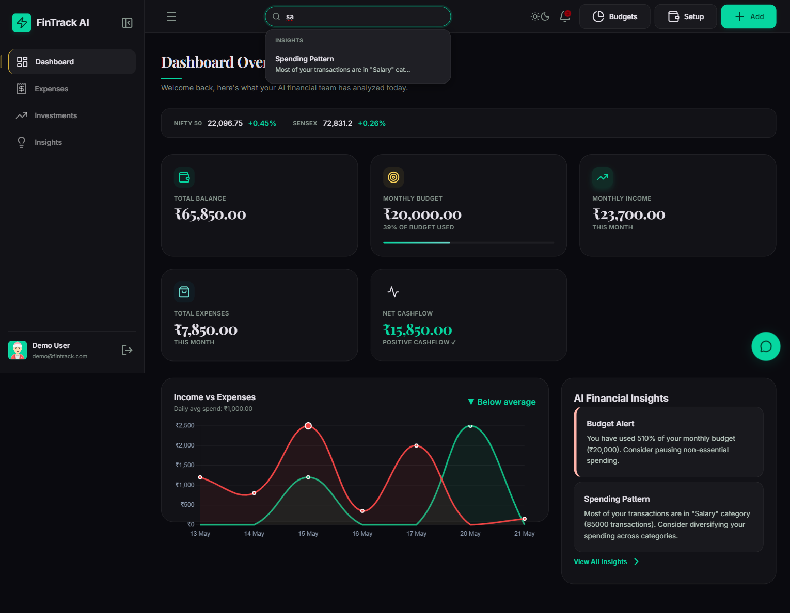
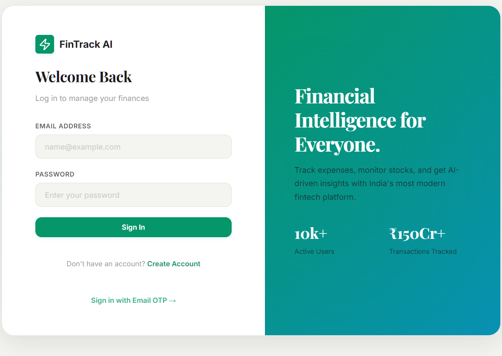

# FinTrack AI — Smart Personal Finance Dashboard

[](https://extracker-m9z7dyq8l-samanyu-thakurs-projects.vercel.app)
[](LICENSE)

> **Track expenses, monitor stocks, and get AI-driven insights** 



## ✨ Features

### 💰 Expense Tracking
- Full CRUD for income & expense entries
- Per-category budgets with real-time spent tracking
- CSV export with date filtering
- Search across transactions, stocks, and insights

### 📈 Investment Portfolio
- Track stock holdings (buy/sell)
- Real-time NIFTY 50 & SENSEX ticker
- Portfolio summary with total value, gain/loss
- AI-powered stock recommendations

### 🤖 AI-Powered Insights
- AI chatbot for financial queries (Groq-powered)
- Smart budget alerts and spending pattern analysis
- Stock market AI recommendations and analysis

### 🎨 Premium Design
- **FinTrack Noir** — Dark glassmorphic UI with emerald & gold accents
- Playfair Display + Inter typography
- Collapsible sidebar with smooth transitions
- Dark/Light theme toggle
- Fully responsive (desktop, tablet, mobile)
- Material Symbols Outlined icons

### 🔐 Security
- JWT-based authentication
- Email OTP login support
- Rate-limited auth routes
- Session management with secure cookies

---

## 🚀 Tech Stack

| Layer | Technology |
|-------|-----------|
| **Frontend** | Vanilla JS, CSS3 (glassmorphism, custom properties), HTML5 |
| **Backend** | Node.js, Express.js |
| **Database** | Turso (SQLite via `@libsql/client`) — serverless, edge-ready |
| **Auth** | JWT (jsonwebtoken) + bcryptjs |
| **AI** | Groq API (Mixtral/Llama models) |
| **Testing** | Playwright (E2E + API tests) |
| **Deployment** | Vercel (Serverless Functions) |
| **Fonts** | Playfair Display, Inter, Material Symbols Outlined |

---

## 📦 Local Development

### Prerequisites
- Node.js 18+
- npm
- A [Turso](https://turso.tech) database (free tier) — for production features
- A [Groq](https://console.groq.com) API key (free) — for AI features

### Setup

```bash
# Clone the repo
git clone https://github.com/Samanyu-Thakur1703/Expense_Tracker.git
cd Expense_Tracker

# Install dependencies
npm install

# Copy environment config
cp .env.example .env
```

Edit `.env` with your values:

| Variable | Required | Description |
|----------|----------|-------------|
| `JWT_SECRET` | ✅ Yes | Generate with `node -e "console.log(require('crypto').randomBytes(32).toString('hex'))"` |
| `TURSO_DATABASE_URL` | Production | Your Turso database URL |
| `TURSO_AUTH_TOKEN` | Production | Your Turso auth token |
| `GROQ_API_KEY` | For AI | From [console.groq.com](https://console.groq.com) |
| `SMTP_*` | For OTP | SMTP config for email OTP login |

### Run

```bash
# Start dev server (with file watching)
npm run dev

# Or production mode
npm start
```

The app runs at **`http://localhost:3001`**.

### Demo Credentials

```
Email:    demo@fintrack.com
Password: demo1234
```

The demo account comes pre-seeded with sample expenses, income, investments, and budgets.

---

## 🧪 Testing

```bash
cd tests
npx playwright test --config=playwright.config.ts
```

**29 tests** covering:
- 6 browser E2E tests (login, expenses, dark mode, responsive, AI chatbot, stock manager)
- 23 API tests (expenses, investments, budgets, search, export, auth)

---

## 🚢 Deployment

### Deploy to Vercel

```bash
# Install Vercel CLI
npm i -g vercel

# Deploy
vercel --prod
```

**Required environment variables in Vercel:**

| Variable | Description |
|----------|-------------|
| `TURSO_DATABASE_URL` | Turso database URL |
| `TURSO_AUTH_TOKEN` | Turso auth token |
| `GROQ_API_KEY` | Groq API key for AI features |
| `JWT_SECRET` | Strong random string |
| `SMTP_HOST` / `SMTP_PORT` / `SMTP_USER` / `SMTP_PASS` | SMTP config for OTP emails |

### Vercel Setup Notes

- Serverless entry: `api/index.js` wraps the Express app
- `vercel.json` routes all traffic through the serverless function
- Static files in `public/` are served by Express
- Database is Turso (not local SQLite) when `NODE_ENV=production` or `VERCEL` env is set

---

## 📁 Project Structure

```
ex_tracker/
├── api/
│   └── index.js            # Vercel serverless entry point
├── db/
│   └── schema.js           # Database schema + initialization
├── middleware/
│   └── auth.js             # JWT auth middleware
├── public/
│   ├── index.html          # SPA entry (FinTrack Noir design)
│   ├── style.css           # Full glassmorphic design system
│   ├── script.js           # Client-side app logic
│   └── sw.js               # Service Worker (PWA)
├── routes/
│   ├── auth.js             # Login, signup, OTP
│   ├── expenses.js         # Expense/income CRUD + CSV export
│   ├── investments.js      # Stock holdings CRUD + portfolio
│   ├── budgets.js          # Per-category budgets
│   ├── stocks.js           # NIFTY/SENSEX + stock data
│   ├── search.js           # Global search
│   └── ai.js               # AI chatbot + insights
├── tests/
│   ├── *.spec.ts           # Playwright browser E2E tests
│   └── api/*.test.js       # Playwright API tests
├── scripts/
│   └── seed-demo.js        # Seed data for demo user
├── server.js               # Express app setup + startup
├── vercel.json             # Vercel deployment config
└── package.json
```

---

## 📸 Screenshots

| Login | Dashboard |
|-------|-----------|
|  |  |

> Full screenshot gallery coming soon.

---

## 🗺️ Roadmap

- [ ] Mutual fund tracking
- [ ] Recurring transaction automation
- [ ] Bill reminders & notifications
- [ ] Multi-currency support
- [ ] PWA offline mode
- [ ] Dark/light theme persistence
- [ ] Data export (PDF statements)

---

## 📄 License

MIT © [Samanyu Thakur](https://github.com/Samanyu-Thakur1703)
MIT © [Tamanna Kakkar](https://github.com/TamannaKakkar2310)
